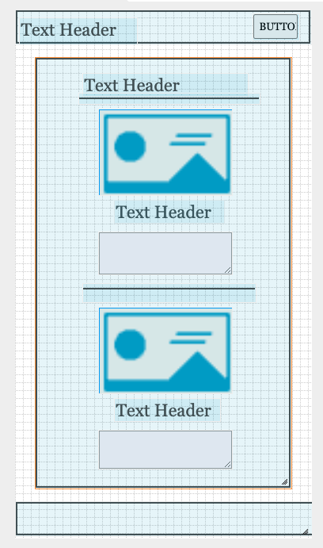
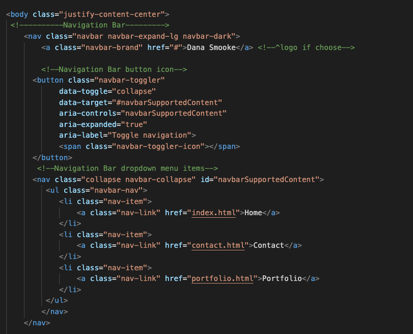
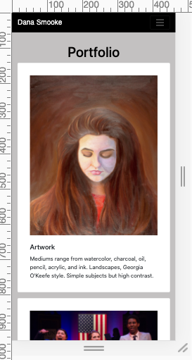

# Responsive Portfolio

## Description

A responsive portfolio built from scratch using Bootstrap.

\*\* **Update: March 30, 2021** \*\*

Refactored original responsive portfolio to use React.js.

See [React Portfolio](https://github.com/dsmooke/react-portfolio) to view documentation.

View refactored deployed app [here](https://dsmooke.github.io/responsive-portfolio/).

## Technologies Used

- React.js
- Node.js
- w3schools stylesheet
- HTML
- JavaScript
- CSS

## Goals

1. A portfolio that is mobile responsive, or a website with webpages whose format and content respond to the visual constraints of a mobile phone and the latitude of a desktop.

2. The code for the HTML must be accessible - the code must have semantic HTML.

### Sub-goals

In order to be considered _Responsive_ our site must have the following:

- proper index.html, portfolio.html, and contact.html files that adhere to accessibility standards (use semantic HTML)

- Proper use of Bootstrap components and grid system.

- A navbar that is consistent across each page

- On each page must contain (on navbar) links to Home/About, Contact, and Portfolio pages. (ex. _dsmooke.github.io/responsive-portfolio/home_)

- A responsive layout

- Responsive images that adjust with brower size

- A valid and correct HTML on each page (confirm via a validation service)

- Your personalized information (bio, name, images, links to social media, etc.)

## Developer

For my responsive portfolio I focused on creating wireframes to help visualize the finished product, as well as trying to wrap my head around how to efficiently integrate and edit Bootstrap stylesheets. Easier said than done.

While some developers would disagree with inserting comments that explain each of their code's components; I, on the otherhand, believe that doing so makes my code more accessible, not only for the user, but also for anyone who wants to learn how to code and make his/her/their own responsive portfolio.

## Mock-Up

The following image shows the web application's _original_ appearance and functionality:

